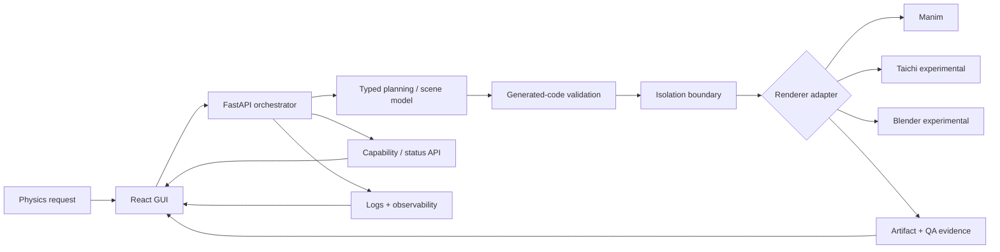

# Physics Foundry

> **Local-first orchestration for generated scientific media.**  
> A systems-oriented prototype for turning bounded physics requests into typed plans, isolated renderer jobs, inspectable artifacts, and explicit quality evidence.

Physics Foundry explores a harder problem than “AI writes animation code”: **how do you make generated scientific media observable, reproducible, and honest about what actually ran?**

The project is built around one rule:

> **A capability is not real because the UI can draw it. It is real when the execution path and evidence exist.**

**Current status:** active engineering prototype. The orchestration semantics, capability reporting, backend-driven monitoring, generated-code policy, and no-host-fallback sandbox contract are implemented. A retained real prompt → generated Manim → sandbox → MP4 → measured-QA reference run is the next proof milestone.

---

## What is real today

| Capability | Evidence state |
| --- | --- |
| React/Vite portfolio GUI | ✅ implemented in `apps/gui/` |
| FastAPI orchestration service | ✅ implemented |
| REST + WebSocket pipeline status paths | ✅ implemented |
| Explicit capability discovery | ✅ implemented + contract-tested |
| Deterministic orchestration fixtures | ✅ distinct `fixture_complete` semantics |
| Backend-driven pipeline monitor | ✅ no client-side fake completion |
| Backend-driven system monitor | ✅ no randomized hardware/model readiness |
| Generated-code AST/path policy | ✅ implemented + contract-tested |
| Direct host execution fallback | ✅ removed by design |
| Firejail execution wrapper | ◐ implemented; adversarial runtime verification still open |
| Deterministic QA interface fixture | ◐ implemented and explicitly labeled demo data |
| Real prompt → renderer → MP4 → measured QA proof | ○ next milestone |
| Autonomous production-ready multi-engine generation | ○ not claimed |

See [`docs/CLAIMS.md`](docs/CLAIMS.md) for the claim ledger and [`docs/IMPLEMENTATION_STATUS.md`](docs/IMPLEMENTATION_STATUS.md) for the implementation boundary.

---

## Why the architecture matters

Generated-media prototypes often blur four very different things:

1. a component exists,
2. a dependency is installed,
3. a deterministic fixture can exercise the interface,
4. a real end-to-end operation completed.

Physics Foundry keeps those states separate.



The important separation is semantic as much as architectural:

```text
planning  != rendering
installed != verified
fixture   != live
UI state  != capability
success   != “the code reached the end”
```

---

## Explicit terminal semantics

The backend does not collapse every terminal outcome into “success.”

| State | Meaning |
| --- | --- |
| `complete` | a supported real operation completed |
| `fixture_complete` | deterministic orchestration fixture completed; **no media-generation claim** |
| `unsupported` | the required real capability is unavailable or not wired |
| `error` | a supported operation was attempted and failed |

This replaced earlier prototype behavior that could simulate work and eventually report completion without producing a real artifact.

---

## Generated-code boundary

Generated renderer code is treated as untrusted input.

Static policy currently rejects or constrains high-risk behavior including disallowed imports/calls, relative imports, dynamic execution patterns, shell-like execution, absolute staging paths, and parent-path traversal.

Those checks are defense-in-depth. They are **not** presented as the isolation boundary by themselves.

Real generated-code execution currently requires the supported Firejail path. If that backend is unavailable, Physics Foundry returns `unsupported` instead of silently running generated Python or Blender code directly on the host.

`nsjail` may be detected as installed, but it is not currently promoted to a verified execution backend.

Runtime isolation hardening remains tracked in [`SECURITY.md`](SECURITY.md) and issue #27.

---

## Run the interface

### 1. GUI

```bash
git clone https://github.com/ddelucchi/physics-foundry.git
cd physics-foundry
npm ci
npm run dev:gui
```

The canonical frontend is `apps/gui/`. The repository root is a workspace coordinator, not a second application.

### 2. Orchestrator API

Python 3.11 is the reference interpreter.

```bash
cd apps/orchestrator
python -m pip install -e .
python -m uvicorn orchestrator.main:app --reload --port 8000
```

Useful endpoints:

```text
GET  /health
GET  /status
GET  /capabilities
GET  /metrics
POST /api/pipeline/create
GET  /api/pipeline/{pipeline_id}/status
```

The GUI defaults to `http://127.0.0.1:8000`. Override with `VITE_ORCHESTRATOR_URL` when needed.

---

## Dependency-light verification

The portfolio contract intentionally avoids requiring a GPU, local LLM, renderer stack, or Firejail runtime.

```bash
python -m pip install \
  "pydantic>=2.5,<3" \
  "pytest>=7.4,<9" \
  "pytest-asyncio>=0.21,<1"

PYTHONPATH=apps/orchestrator pytest -q \
  apps/orchestrator/tests/test_portfolio_contract.py \
  apps/orchestrator/tests/test_sandbox_runtime_contract.py
```

The contract covers:

- fixture-vs-live completion semantics,
- capability reporting,
- Pydantic model isolation,
- generated-code validation,
- workspace path traversal rejection,
- sandbox backend selection,
- and the invariant that unavailable or unverified isolation **never falls back to direct host execution**.

For the full evidence ladder, see [`docs/REPRODUCIBILITY.md`](docs/REPRODUCIBILITY.md).

---

## Demo, fixture, and live provenance

Physics Foundry uses three explicit provenance classes:

**Demo**  
Deterministic synthetic values used to exercise interface behavior.

**Fixture**  
Deterministic backend values used to exercise orchestration semantics.

**Live**  
Values returned by an actual service, renderer, analyzer, or measurement path.

The GUI labels this boundary. The pipeline and system monitors query the orchestrator instead of generating pretend telemetry in the browser.

---

## Repository map

```text
physics-foundry/
├── apps/
│   ├── gui/                  # canonical React/Vite interface
│   └── orchestrator/         # FastAPI service + execution/QA boundaries
├── packages/                 # shared / plugin-oriented packages
├── config/                   # runtime and renderer configuration
├── docs/
│   ├── CLAIMS.md             # public claim ledger
│   ├── IMPLEMENTATION_STATUS.md
│   ├── PORTFOLIO_ROADMAP.md
│   ├── PRD.md                # product vision, not a capability claim
│   └── REPRODUCIBILITY.md
├── scripts/
├── SECURITY.md
└── CONTRIBUTING.md
```

---

## Next proof milestone

The next milestone is intentionally narrow and falsifiable:

```text
bounded prompt
    ↓
schema-valid scene plan
    ↓
generated Manim source persisted before execution
    ↓
sandboxed renderer invocation
    ↓
non-empty MP4
    ↓
real quality measurement
    ↓
retained plan + source + command + logs + artifact + QA
```

Only after that chain is reproducible from a clean checkout does renderer breadth become the priority.

That ordering is deliberate. **Depth of proof beats breadth of placeholders.**

---

## Engineering philosophy

Physics Foundry is being developed with an evidence-first portfolio standard:

- interfaces are not proof,
- TODOs are not features,
- installed binaries are not successful integrations,
- synthetic telemetry is not measurement,
- deterministic fixtures are not live output,
- and a process returning zero is not enough to establish a trustworthy result.

A smaller verified system is more useful than a larger imaginary one.

---

## License

MIT. See [`LICENSE`](LICENSE).
